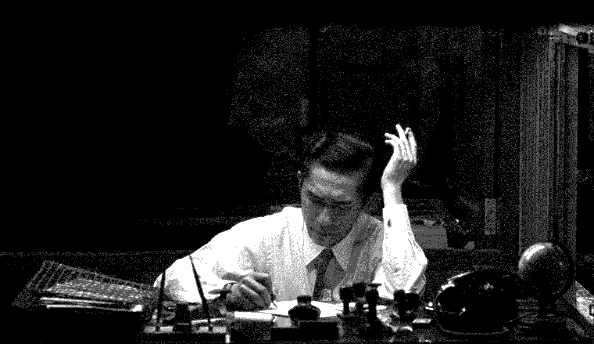
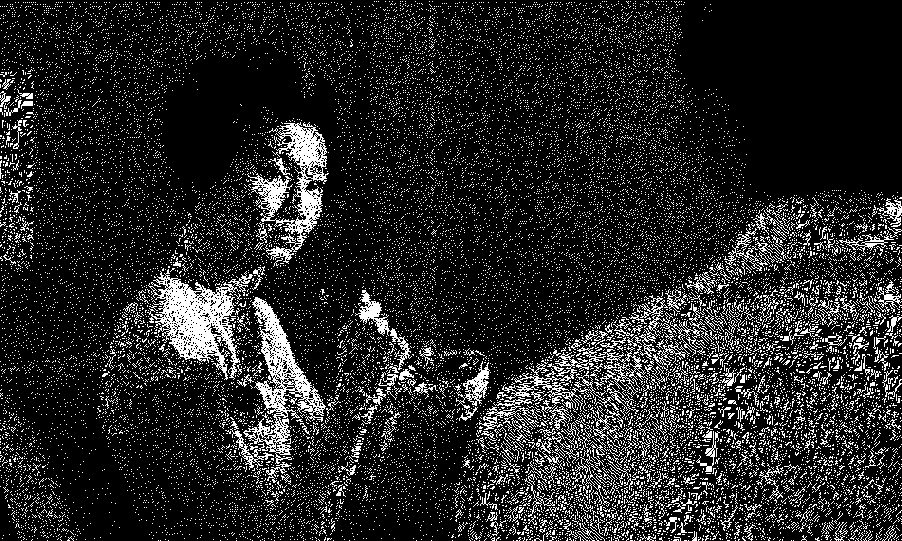
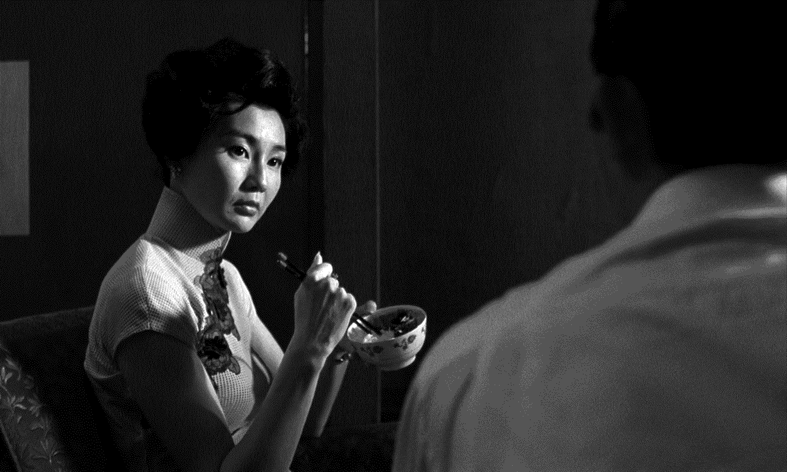
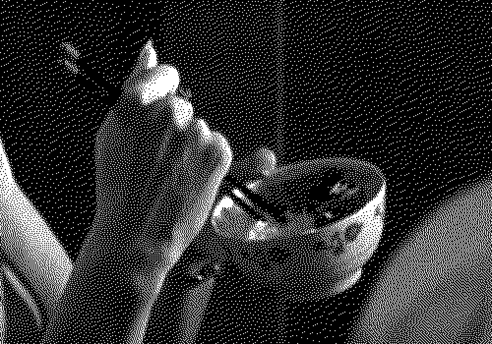

# vsmp-zero
A very slow movie player designed for the Raspberry Pi Zero

## Features

* Variable color depth dithering
* Optimized, pixel-packed data transfer
* On-device white-level adjustment
* So many dithering modes
* Supports all panels using IT8951 controller
* Supports hardware accelerated video decoding
* Supports ambient light sensing to pause display updates in darkness



## Context

This is my take on the concept of a very slow movie player, as previously done by [Tom Whitwell](https://debugger.medium.com/how-to-build-a-very-slow-movie-player-in-2020-c5745052e4e4)
and, originally, [Bryan Boyer](https://medium.com/s/story/very-slow-movie-player-499f76c48b62).  
As opposed to their implementations, this one is written in C to be close to the hardware, using libav and the [IT8951 C library](https://github.com/waveshare/IT8951) by waveshare to display frames from a video file on an ePaper display.

The code is designed for and tested with the [1872x1404 E-Ink panel](https://www.waveshare.com/product/raspberry-pi/displays/e-paper/7.8inch-e-paper-hat.htm) from waveshare. Other panels using the same controller should work out of the box, for other panels you might have to customize the `processFrame` method.

## Dependencies

This repo comes with a modified version of the IT8951 library, so all you need is the [bcm2835](http://www.airspayce.com/mikem/bcm2835/) library as well as libavformat, libavcodec and libavutil.  
To use hardware acceleration for video decoding, you'll have to use custom-built ffmpeg libraries (see [https://maniaclander.blogspot.com/2017/08/ffmpeg-with-pi-hardware-acceleration.html](https://maniaclander.blogspot.com/2017/08/ffmpeg-with-pi-hardware-acceleration.html)).

## Pre-processing

vsmp-zero does not perform scaling, grayscale or framerate conversion of the video at runtime to save on computation and implementation complexity. You should pre-process your input accordingly on a faster machine using ffmpeg.

An example preprocessing command might look like this:  
`ffmpeg -i in.mkv -an -sn -c:v libx264 -vf "fps=fps=7,format=gray,pad=max(iw\,ih*(16/9)):ow/(16/9):(ow-iw)/2:(oh-ih)/2,scale=1872:-1" -aspect 16:9 -threads 4 out.mkv`  

This command removes any audio- or subtitle tracks, pads the input to a 16:9 aspect ratio with a width of 1872 px (the width of our panel), and reduces the framerate to 7fps such that playing the file frame-by-frame will be around 3x faster than playing at the original speed (assuming a 24fps input framerate). It also encodes the video in grayscale h264, for which the Raspberry Pi has hardware decoding support. 

## Usage

Configure `vsmp.h` to your liking, then run `make vsmp`. Because the libav libraries are linked statically (dynamic linking won't work for some reason), this might take a minute and produce a very large binary file. Also make sure you have enabled SPI on your Raspberry using `raspi-config`.  

You can now run vsmp as follows:

`sudo ./vsmp [video file] [start frame index]`  

Root rights are necessary to use SPI and the GPIO pins.  

To continue running after you close the console, you might want to use `nohup` as follows:

`sudo nohup ./vsmp [video file] [start frame index] &`

The current frame index is backed up periodically to a file called `vsmp-index`. If the frame index argument is omitted on startup and an index file is found, playback is resumed at the last saved frame index.  

If you'd like to have vsmp started automatically on boot, you might want to use this very bare-bone systemd service file:

```
[Unit]
Description=VSMP

[Service]
Type=simple
User=root
WorkingDirectory=[this is where the vsmp-index file will be]
ExecStart=[path to vsmp executable] [path to video file relative to working dir]

[Install]
WantedBy=multi-user.target
```

You can save the contents of this file to e.g. `/etc/systemd/system/vsmp.service` and then run `sudo systemctl enable vsmp` to start vsmp on boot.

## Dithering Algorithms

Do you need nine different dithering algorithms? Probably not. The default should be fine, and for high-res displays with multiple grey-levels you probably won't be able to tell most of them apart. But it turns out image halftoning is a fascinating rabbit hole and there are loads of different ways to do it - so why not play with a bunch of them?  
Currently, vsmp-zero supports the following dithering modes:

- Floyd-Steinberg (regular and serpentine, default)
- Interleaved Noise
- Blue Noise
- White Noise
- Sierra (full and two-row versions)
- Stucki
- Atkinson

## Sample images

If you're not inspired yet, here's another sample image from *In the Mood for Love* which I think came out really great. The first image is dithered to 1 bit per pixel, the second one to 2 bits per pixel.





